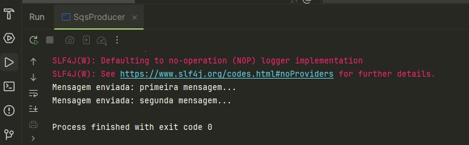
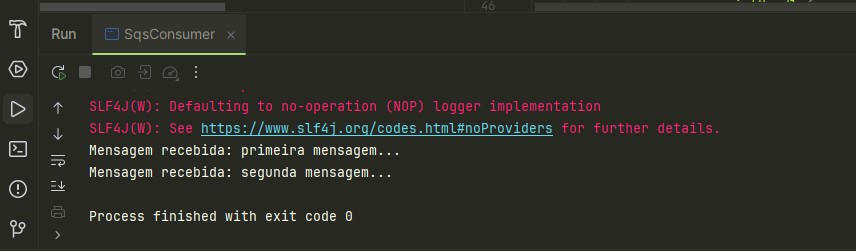

# Mensageria Amazon SQS (Simple Queue Service)
O Amazon SQS (Simple Queue Service) é um serviço de filas de mensagens gerenciado pela AWS que permite a comunicação assíncrona entre diferentes partes de um sistema. Ele funciona como uma fila de mensagens onde uma parte do sistema pode enviar mensagens para a fila, e outra parte pode ler essas mensagens de forma independente, garantindo que os sistemas possam funcionar de forma desacoplada e escalável.

# Projeto: Ferramentas utilizadas
## LocalStack
Para nosso exemplo, utilizamos a ferramenta _LocalStack_: um emulador local do servidor AWS. Com isso, poderemos simular a fila de mensagens SQS.

## Maven
Como temos códigos Java ☕, utilizaremos o Apache Maven para facilitar o build e a gestão de dependências.

## Docker
O LocalStack funciona a partir de um contêiner Docker em nossa máquina. O Docker é capaz de simular um ambiente com todas as ferramentas necessárias para a execução de um projeto.

# Passo a Passo
## Executando LocalStack por meio do Docker
Para colocar o contêiner do LocalStack em execução, abrir o PowerShell ou cmd no Windows e executar:
```powershell
  localstack start
```
(Obs: para que o PowerShell reconheça localstack como um comando, devemos fazer "pip install localstack".)

Algo assim aparecerá no PowerShell:


```powershell
     __                     _______ __             __
    / /   ____  _________ _/ / ___// /_____ ______/ /__
   / /   / __ \/ ___/ __ `/ /\__ \/ __/ __ `/ ___/ //_/
  / /___/ /_/ / /__/ /_/ / /___/ / /_/ /_/ / /__/ ,<
 /_____/\____/\___/\__,_/_//____/\__/\__,_/\___/_/|_|

 💻 LocalStack CLI 3.7.2
 👤 Profile: default

 [09:48:47] starting LocalStack in Docker mode 🐳                                                      localstack.py:503
2024-09-28T09:48:51.568  INFO --- [  MainThread] localstack.utils.bootstrap : Execution of "prepare_host" took 3855.32ms
──────────────────────────────────── LocalStack Runtime Log (press CTRL-C to quit) ────────────────────────────────────

LocalStack version: 3.7.3.dev53
LocalStack build date: 2024-09-27
LocalStack build git hash: 6f16877d1

Ready.
```

Verifique se o docker tem o contêiner do LocalStack executando.

Também é necessário fazer a configuração de autenticação. 

Ainda no PowerShell, executar:
```powershell
aws configure
```

E realizar as autenticações necessárias. Em nosso caso, utilizei:

```powershell
AWS Access Key ID [None]: test
AWS Secret Access Key [None]: test
Default region name [None]: us-east-1
Default output format [None]: json
```

E por fim, criar uma fila também por meio da linha de comando:
```powershell
awslocal sqs create-queue --queue-name minha-fila
```

Obs: a fila deve ter o mesmo nome que será usado dentro da classe java.

## Java
URL da fila:
```java
private static final String QUEUE_URL = "https://sqs.us-east-1.amazonaws.com/000000000000/minha-fila";
```
Nela definimos a região, o ID da conta (Local Stack usa uma sequência de zeros por padrão), e o nome da fila.

Precisamos criar um objeto cliente (sqsClient) como a seguir:
```java
SqsClient sqsClient = SqsClient.builder()
                .region(Region.US_EAST_1)
                .endpointOverride(URI.create("http://localhost:4566"))
                .build();
```
Obs: a região deve ser conforme o configurado na autenticação. O método .endpointoverride sobrescreve o endpoint que seria na nuvem, trocando-o pelo nosso, em localhost (a porta do localstack, por padrão, é a 4566 geralmente).

Por meio do método sendMessage, colocamos duas mensagens em fila.

```java
sendMessage(sqsClient, "primeira mensagem...");
sendMessage(sqsClient, "segunda mensagem...");
```

Em SqsConsumer, definimos a URL da mesma forma.
Criamos o cliente (da mesma forma).

Com o método receiveMessages()...
```java
 public static void receiveMessages(SqsClient sqsClient) {
        ReceiveMessageRequest receiveRequest = ReceiveMessageRequest.builder()
                .queueUrl(QUEUE_URL)
                .maxNumberOfMessages(5)
                .waitTimeSeconds(10) // Long polling
                .build();

        List<Message> messages = sqsClient.receiveMessage(receiveRequest).messages();

        for (Message message : messages) {
            System.out.println("Mensagem recebida: " + message.body());

            // Exclui a mensagem da fila após o processamento
            DeleteMessageRequest deleteRequest = DeleteMessageRequest.builder()
                    .queueUrl(QUEUE_URL)
                    .receiptHandle(message.receiptHandle())
                    .build();
            sqsClient.deleteMessage(deleteRequest);
        }
    }
```
* definimos um número máximo de mensagens.
* criamos um objeto do tipo *List* para guardar as mensagens lidas.
* deletamos as mensagens lidas da fila.

## pom.xml
Foi necessário adicionar a dependência de sqs. 
```xml
<dependency>
     <groupId>software.amazon.awssdk</groupId>
      <artifactId>sqs</artifactId>
      <version>2.28.9</version>
 </dependency>

```

## Executando a fila de mensagens.
1. Executar a classe java SqsProducer (ela enviará as mensagens para a fila.)
   
Em meu exemplo, adicionei duas mensagens na fila para *testar* o que poderia acontecer em seguida.
Obs: ao enviar mais de uma mensagem, é recomendável o envio em lote para economizar chamadas à API. Isso pode ser feito por meio do objeto _SendMessageBatchRequest_.
2. Executar a classe java SqsConsumer.
   
A classe SqsConsumer consumiu o que havia na fila.

## Considerações finais
A execução do exemplo permitiu ter uma noção básica do funcionamento da mensageria SQS, seus principais métodos e seus usos. Além disso, permitiu vivenciar as ferramentas LocalStack e Docker. 


